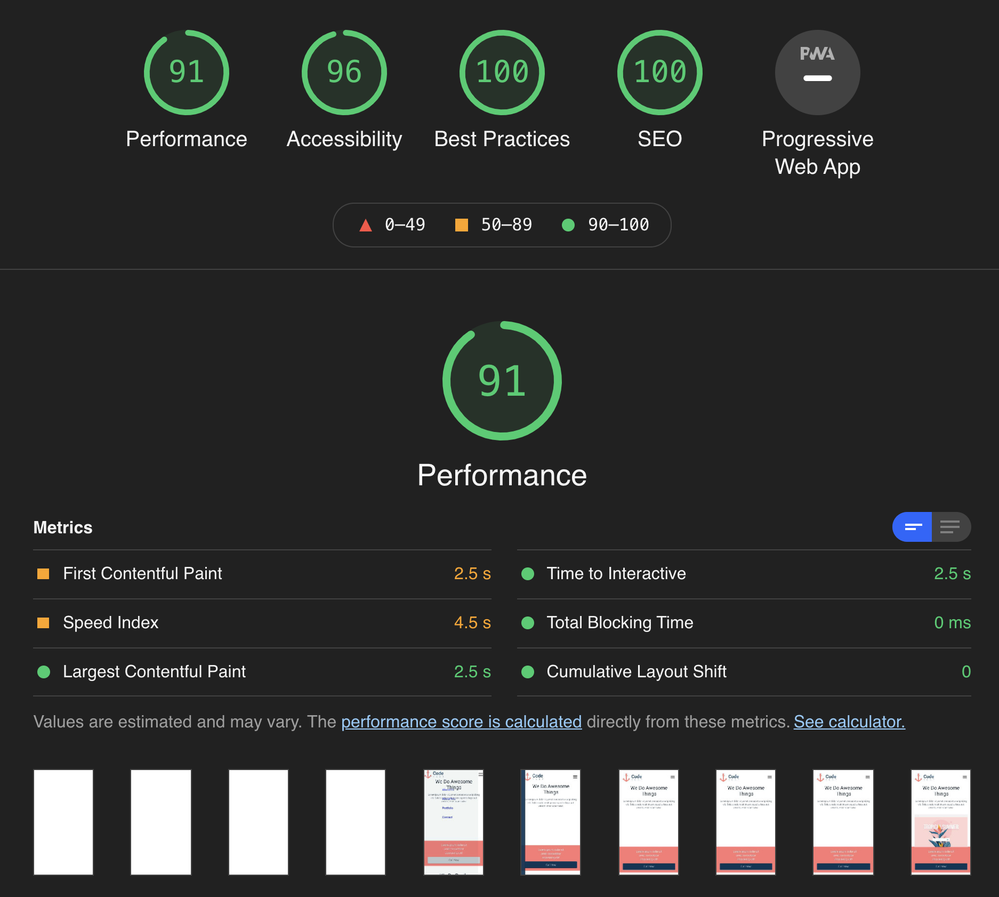

## Getting Started and running on a local machine

1. Download extract the zip file on your local machine.
2. Open with any code editor of your choice.
3. Run 'npm install' or 'yarn install' to install all the necessary dependencies.

### Create .env.local file inside the root of the project

Set NEXT_PUBLIC_API_URL= the API given in the test

## Run the development server:

```bash
npm run dev
# or
yarn dev
```

Open [http://localhost:3000](http://localhost:3000) with your browser to see the result.

## View live [Demo](https://dotcentric-test.netlify.app/) on Netlify

## View live [Demo](https://dotcentric-test.vercel.app/) on Vercel

## Framework: Next.js

In as much as I could have built this challenge with vanilla Javascript, I chose Next.js which is a framework on top of React for the obvious reasons:

#### Faster page loading

Apps built with Next.js is faster when rendering pages than apps built with Create React App

#### File system routing

Apps built with Next.js do not need extra libraries such as React Router or Reach Router. You just have to create a file under pages and you get automatic routing. This helps to speed up development time and ship applications faster.

#### Automatic code spliting.

Code splitting makes it possible to split application code up into a series of lightweight bundles. Instead of loading all of our Javascript, our application will only load the bundle needed.

#### SEO

Next.js is Search Engine Optimization (SEO) friendly as it uses Server-Side Rendering which makes the site accessible to web crawlers.

#### Static Site Generation(SSG)

Note that, the above reasons might not apply to this challenge. However, I wanted to mention these to support my decision for using Next.js. It doesn't mean I will build every project with this framework.

## Component library: Tailwindcss

### I used Tailwindcss to style the application and the reasons are:

1. Easy to customise
2. Faster prototyping of any UI
3. Smaller bundle size in production
4. Team collaboration
5. Future Maintenance
6. Ability to build any complex UI without writing too much custom CSS

You can see with Tailwind CSS, each component has its inline styling which makes it easy for debugging and making changes in the future. It helps developers to always be on the same page when it comes to component styling.

If you are worried about long CSS classes in the return JSX, there is a solution to that but I didn't need to implement all of them looking at the size of this application

These are some options I had:

1. It's possible to extract the classes into react component and make them reusable
2. I could have also used tailwind '@apply' functionality to clean the return JSX'
3. Other libraries can be used with TailwindCSS to make life easy such as twin.macro

You will notice that when the classes get longer than needed I used a library called 'clsx' together with prettier to make the Html element a bit cleaner.

You might be wondering why would you add an extra library to a small web application and the answer is simple. With tailwind CSS, you can ship to production only the tailwind classes used in the application. This is made possible by purging all unused classes and tailwind CSS will be smart enough not to ship them to production. According to the documentation, an average website using Tailwind CSS ships less than 20kb bundle size to production when purged is used. In this application, I purged all unused classes inside the tailwind.config.js file.

## 3rd Party Libraries:

#### xcls

In order not to defeat the purpose of this test, I decided not to rely too much on 3rd party libraries.
When I am building a production app, other libraries help to speed up the development process such as React-hook-form or Formik to handle the input form as well as form validation. I did not use any of these libraries and decided to implement my form validation.

## Files and Component structure

One of the strongest architectural designs of React is its Component-based approach. This makes it very intuitive to build re-usable components, easy to maintain and encourages code readability in React applications.
Though this application is a single page with only a few routing, yet it consists of different and many re-usable components.

You can see that I built the Testimonials, Heading, and ContactForm component with re-usability in mind. These components can easily be used inside other pages of the application if needed.

I took advantage of Next.js static site generation to ensure that, the

## Performace



I built this app with performance in mind. There are four main performance indicators that I consider when building web applications.

1. #### performace
2. #### Accessibility
3. #### SEO
4. #### Best Practice

I use Google Lighthouse which is an open-source, automated tool for improving the quality of web pages. When I build websites, I use them to check the four indicators I mentioned above. By using this tool, you can check and make improvements to a web page. Due to time constraints, I couldn't resolve all the issues reported by Lighthouse. However, I made sure they were in good shape and ready for production.

## Cross Browser Compatibility

Using Lambdatest, I carried out cross-browser compatibility on 4 different browsers including Chrome, Firefox, Safari, and Edge. I had an issue where most of the browsers didn't display SVG images as expected so I had to revert using jpg format to fix that issue.

## Git Flow

I implemented CI/CD and set up the application to run on two different environments on Netlify. I then connected it to the Github repository. This ensures any code pushed to the main/master branch will automatically trigger the build command on Netlify which then builds the production and preview versions of the app.

The reason is that whenever I add a new feature to the app, I can test it on the development environment which I called Preview. When the new feature is tested and approved, I then make a Pull Request which triggers the production build.

## Linting

I set up standard Eslint together with prettier. I find these two combinations to be working fine for me when it comes to code formatting and warning whilst developing.

## Challenges

1. The mockup file was designed in sketch and I didn't have any experience with a sketch before this test. I have worked with Figma before so I applied the basic knowledge. It still took me some time to figure out how to download some assets that I needed to build the application.

## Conclusion

With all that said, I had a lot of fun working on this project and in the process, learned a lot and made some vital decisions as a developer.
